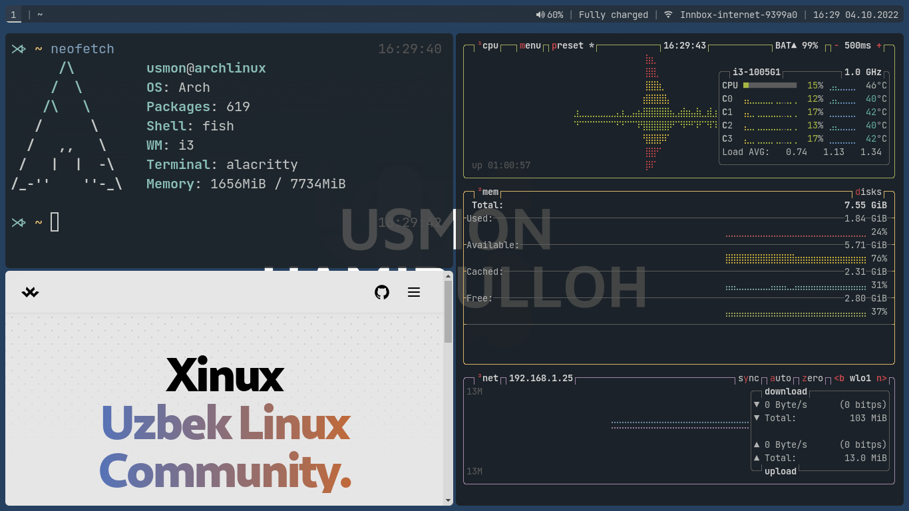

<p align="center">
  <a href="https://github.com/UsmonHamidulloh/dots-i3">
    
  </a>
  <a href="https://github.com/UsmonHamidulloh/dots-i3/blob/main/LICENSE">
    
  </a>
</p>

## What's in?
- **Window Manager:** `i3`
- **Compositor:** `picom`
- **Terminal:** `alacritty`
- **Launcher and Powermenu:** `rofi`
- **Status Bar:** `polybar`
- **Fonts:** 
  - `Jetbrains Mono`
  - `Jetbrains Mono Nerd Fonts`

## To Use

```bash
git clone https://github.com/UsmonHamidulloh/dots-i3
cd dots-i3/
cp -r .config/ $HOME/
```
